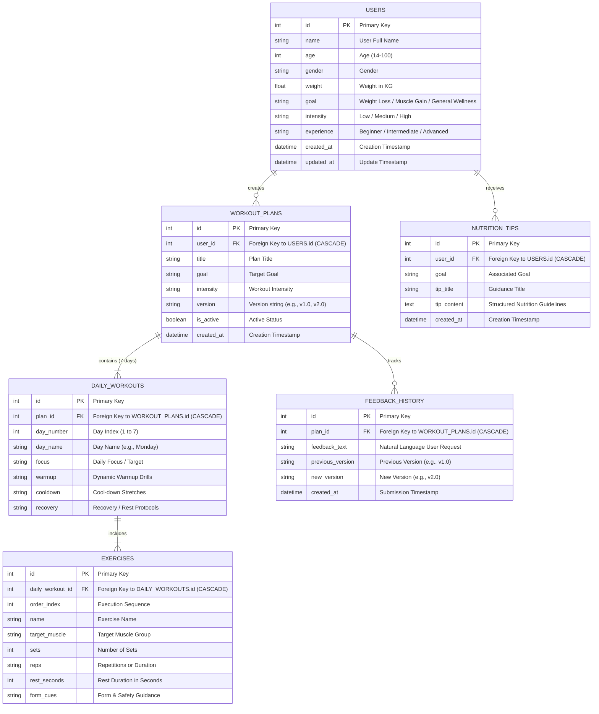

# Phase 3: Project Design Phase - Database Schema & ER Diagram

## 1. Database Overview

FitBuddy uses a fully normalized relational schema designed with SQLAlchemy 2.0 ORM. The schema ensures data integrity, enforces foreign key relationships, supports cascading deletes, and provides efficient query indexing.

---

## 2. Entity-Relationship (ER) Diagram

---

## 3. Detailed Table Specifications

### Table 1: `users`
- `id` (INTEGER, Primary Key, Autoincrement)
- `name` (VARCHAR(100), NOT NULL)
- `age` (INTEGER, NOT NULL)
- `gender` (VARCHAR(20), NOT NULL)
- `weight` (FLOAT, NOT NULL)
- `goal` (VARCHAR(50), NOT NULL)
- `intensity` (VARCHAR(20), NOT NULL)
- `experience` (VARCHAR(20), NOT NULL)
- `created_at` (DATETIME, Default: UTC Now)
- `updated_at` (DATETIME, Default: UTC Now, onupdate: UTC Now)

### Table 2: `workout_plans`
- `id` (INTEGER, Primary Key, Autoincrement)
- `user_id` (INTEGER, Foreign Key `users.id` ON DELETE CASCADE, Index)
- `title` (VARCHAR(150), NOT NULL)
- `goal` (VARCHAR(50), NOT NULL)
- `intensity` (VARCHAR(20), NOT NULL)
- `version` (VARCHAR(10), Default: `"1.0"`)
- `is_active` (BOOLEAN, Default: `True`)
- `created_at` (DATETIME, Default: UTC Now)

### Table 3: `daily_workouts`
- `id` (INTEGER, Primary Key, Autoincrement)
- `plan_id` (INTEGER, Foreign Key `workout_plans.id` ON DELETE CASCADE, Index)
- `day_number` (INTEGER, NOT NULL)
- `day_name` (VARCHAR(20), NOT NULL)
- `focus` (VARCHAR(100), NOT NULL)
- `warmup` (TEXT, NOT NULL)
- `cooldown` (TEXT, NOT NULL)
- `recovery` (TEXT, NULLABLE)

### Table 4: `exercises`
- `id` (INTEGER, Primary Key, Autoincrement)
- `daily_workout_id` (INTEGER, Foreign Key `daily_workouts.id` ON DELETE CASCADE, Index)
- `order_index` (INTEGER, NOT NULL)
- `name` (VARCHAR(100), NOT NULL)
- `target_muscle` (VARCHAR(50), NOT NULL)
- `sets` (INTEGER, NOT NULL)
- `reps` (VARCHAR(30), NOT NULL)
- `rest_seconds` (INTEGER, Default: 60)
- `form_cues` (TEXT, NULLABLE)

### Table 5: `feedback_history`
- `id` (INTEGER, Primary Key, Autoincrement)
- `plan_id` (INTEGER, Foreign Key `workout_plans.id` ON DELETE CASCADE, Index)
- `feedback_text` (TEXT, NOT NULL)
- `previous_version` (VARCHAR(10), NOT NULL)
- `new_version` (VARCHAR(10), NOT NULL)
- `created_at` (DATETIME, Default: UTC Now)

### Table 6: `nutrition_tips`
- `id` (INTEGER, Primary Key, Autoincrement)
- `user_id` (INTEGER, Foreign Key `users.id` ON DELETE CASCADE, Index)
- `goal` (VARCHAR(50), NOT NULL)
- `tip_title` (VARCHAR(150), NOT NULL)
- `tip_content` (TEXT, NOT NULL)
- `created_at` (DATETIME, Default: UTC Now)
