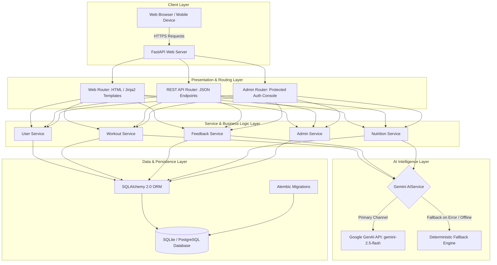

# Phase 3: Project Design Phase - System Architecture Design

## 1. Architectural Overview

FitBuddy utilizes a clean, decoupled, layered architectural pattern engineered for high reliability, fast response times, and AI resilience.

---

## 2. High-Level System Architecture Diagram

---

## 3. Layer Breakdown & Responsibilities

### 1. Presentation & Routing Layer (`app/routers/` & `app/templates/`)
- **Web Router (`web.py`)**: Renders dynamic Jinja2 server-rendered views (Landing, Profile, Generating, Result, Feedback, Nutrition, History, Error).
- **API Router (`api.py`)**: Exposes RESTful JSON endpoints with Pydantic boundary validation for client integrations and testing.
- **Admin Router (`admin.py`)**: Manages administrator authentication, signed cookie verification, session lifecycle, and dashboard analytics rendering.

### 2. Service & Business Logic Layer (`app/services/`)
- **`user_service.py`**: Handles user entity creation, validation, querying, and profile updates.
- **`workout_service.py`**: Coordinates workout plan generation, parses AI JSON payloads, and persists normalized relational workout tables.
- **`feedback_service.py`**: Executes revision requests, triggers AI remodeling, manages version numbers (`v1.0 -> v2.0`), and records feedback audit history.
- **`nutrition_service.py`**: Builds goal-aligned nutrition, hydration, and recovery guidelines.
- **`admin_service.py`**: Handles password hashing (`PBKDF2-HMAC-SHA256`), session signing (`HMAC-SHA256`), and aggregate metric computations.

### 3. AI Intelligence Layer (`app/services/gemini_service.py` & `app/prompts/`)
- Encapsulates Google GenAI SDK integration with `gemini-2.5-flash`.
- Employs structured system instructions, few-shot prompt definitions, and strict JSON response schemas.
- Implements a deterministic fallback generator that produces high-quality, scientifically sound 7-day plans without network dependency.

### 4. Data & Persistence Layer (`app/db/`)
- **SQLAlchemy 2.0 ORM**: Maps Python entity classes to database tables with strict relationship mappings and cascade delete rules.
- **Alembic**: Provides automated, version-controlled database schema migration scripts.
