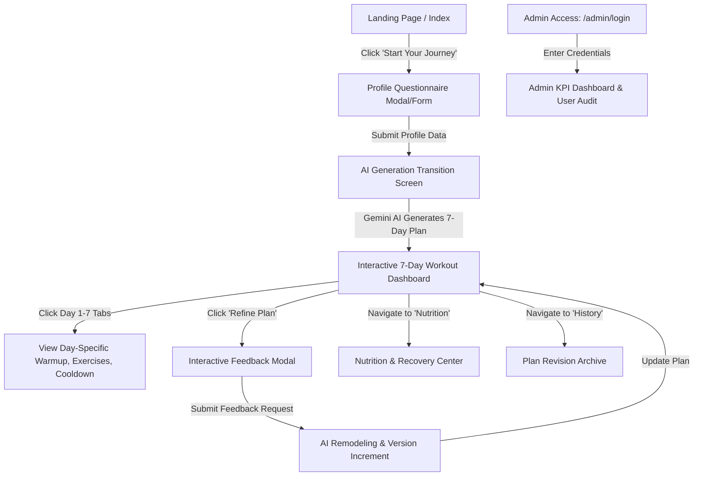

# Phase 3: Project Design Phase - UI/UX Wireframes & User Journey Flow

## 1. Design System & Aesthetic Foundation

FitBuddy incorporates an athletic dark-mode design system engineered for high visual contrast, energetic motivation, and effortless mobile usability.

### Color Palette Tokens:
- **Background Base**: `#0B0E14` (Deep obsidian black)
- **Card & Surface Background**: `#161B26` / `#1F2633` (Elevated dark slate)
- **Primary Athletic Accent**: `#C8FF00` (Volt Lime / High-voltage neon)
- **Secondary Accent**: `#00F0FF` (Electric Cyan)
- **Success / Positive Accent**: `#10B981` (Emerald Green)
- **Warning Accent**: `#F59E0B` (Amber Flame)
- **Danger / Deletion**: `#EF4444` (Crimson Red)
- **Typography**: Google Fonts `Outfit` (Headings) and `Inter` (Body text)

---

## 2. End-to-End User Journey Flow



---

## 3. UI Wireframe Layouts

### 1. Landing Page (`index.html`)
```
+---------------------------------------------------------------+
|  ⚡ FitBuddy                [Home] [Nutrition] [Admin] [Start] |
+---------------------------------------------------------------+
|                                                               |
|        AI-POWERED WORKOUTS DESIGNED SPECIFICALLY FOR YOU      |
|    Experience 7-day science-backed training and nutrition     |
|                                                               |
|              [ 🚀 Generate Your 7-Day Plan Now ]              |
|                                                               |
|   +-------------------+  +-------------------+  +-----------+ |
|   | ⚡ 7-Day Routine  |  | 🔄 Adaptive AI    |  | 🥗 Macros | |
|   | Warmups & Sets    |  | Feedback Loop     |  | & Recovery| |
|   +-------------------+  +-------------------+  +-----------+ |
+---------------------------------------------------------------+
```

### 2. Interactive 7-Day Microcycle Result (`result.html`)
```
+---------------------------------------------------------------+
| Plan: Weight Loss Microcycle (v1.0)        [ ✏️ Refine Plan ]  |
+---------------------------------------------------------------+
| [ Day 1 ] [ Day 2 ] [ Day 3 ] [ Day 4 ] [ Day 5 ] [ Day 6 ] [ Day 7 ]
+---------------------------------------------------------------+
| Day 1: Full Body Metabolic Conditioning                       |
| 🔥 Warmup: 5 min dynamic jumping jacks and arm circles         |
|                                                               |
| EXERCISES:                                                    |
| 1. Bodyweight Squats  | 3 Sets | 15 Reps | Rest: 60s          |
|    Cue: Keep knees tracking over toes, maintain upright chest. |
| 2. Push-ups           | 3 Sets | 10-12 Reps | Rest: 60s       |
|    Cue: Keep core braced and elbows at 45 degrees.            |
| 3. Plank Hold         | 3 Sets | 45 Secs | Rest: 45s          |
|                                                               |
| ❄️ Cool-down: 5 min full body stretching & breathing drills    |
| 💤 Recovery: 2.5L water target, 8 hours sleep                 |
+---------------------------------------------------------------+
```

### 3. Plan Refinement Modal (`feedback.html`)
```
+---------------------------------------------------------------+
| 🔄 Refine Your Workout Plan (Current Version: v1.0)           |
+---------------------------------------------------------------+
| What would you like to change?                                |
| [ "Make Thursday a rest day and add more shoulder work on Day 2" ] |
|                                                               |
| [ Cancel ]                         [ ⚡ Remodel Workout Plan ] |
+---------------------------------------------------------------+
```
