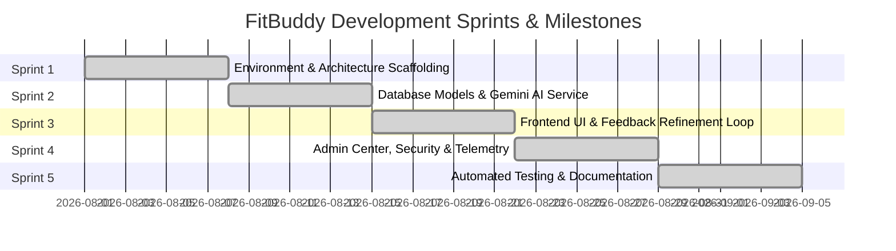

# Phase 4: Project Planning Phase - Project Roadmap & Agile Sprints

## 1. Agile Project Methodology

FitBuddy development followed an Agile Scrum framework executed across 5 focused 1-week sprint iterations, progressing systematically from architectural scaffolding to full AI integration, hardening, and release.

---

## 2. Sprint Breakdown & Milestones

---

## 3. Detailed Sprint Objectives & Deliverables

### Sprint 1: Foundation & Scaffolding
- **Objectives**: Initialize repository, configure environment settings, setup FastAPI application lifespan, establish modular package structure.
- **Key Deliverables**:
  - `app/core/config.py` with Pydantic Settings
  - `app/core/logging.py` centralized structured logger
  - Alembic initialization (`alembic.ini`, `migrations/env.py`)
  - Base health check endpoints (`/health`, `/api/health`)

### Sprint 2: Data Persistence & Gemini GenAI Integration
- **Objectives**: Define SQLAlchemy 2.0 ORM models, build Pydantic v2 validation schemas, implement Google GenAI client (`gemini-2.5-flash`), and design zero-downtime deterministic fallback engine.
- **Key Deliverables**:
  - SQLAlchemy models (`User`, `WorkoutPlan`, `DailyWorkout`, `Exercise`, `FeedbackHistory`, `NutritionTip`)
  - `app/services/gemini_service.py` with structured JSON parsing
  - `app/prompts/workout.py` prompt templates
  - Initial database migration scripts applied

### Sprint 3: Interactive UI & Feedback Refinement Engine
- **Objectives**: Implement Jinja2 HTML templates, athletic dark-mode CSS design system, responsive day switcher JavaScript, and bidirectional feedback remodeling loop.
- **Key Deliverables**:
  - `app/templates/` (landing, profile, result, feedback modal, nutrition)
  - `static/css/style.css` & `static/js/app.js`
  - `app/services/feedback_service.py` with version tracking (`v1.0 -> v2.0`)
  - Seamless form submission and loading transition screen

### Sprint 4: Security, Admin Console & Nutrition Center
- **Objectives**: Implement PBKDF2 password hashing, HMAC signed session cookies, admin analytics dashboard, cascading user deletion, and nutrition guidance engine.
- **Key Deliverables**:
  - `app/core/security.py` password hashing & cookie signer
  - `app/routers/admin.py` & `app/templates/admin/` dashboard
  - `app/services/nutrition_service.py` goal-aligned dietary guidelines

### Sprint 5: Testing, Hardening & Final Documentation
- **Objectives**: Build comprehensive automated test suite (Pytest), execute security and boundary audit, document full system lifecycle, and prepare demonstration walkthrough.
- **Key Deliverables**:
  - 31 passing Pytest automated test cases across all modules
  - 100% test passing verification
  - 8-phase project documentation package
